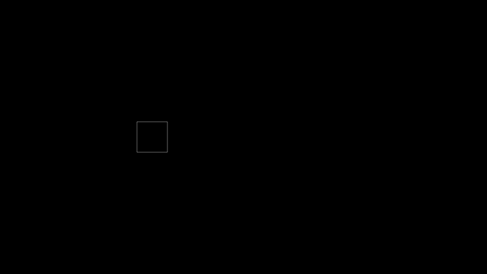

============================================================
Welcome to *AnAnimLib*
============================================================
.. image:: images/Logo.gif
  :width: 100%

|

AnAnimLib was inspired by `ManimLib <https://github.com/3b1b/manim>`_ by Grant
Sanderson of `3Blue1Brown <https://www.youtube.com/c/3blue1brown>`_.  The aim of
AnAnimlib is to facilitate the creation of mathematically preceise animations
through an intuitive and extensible API.

The following code spins a square it as it moves across the canvas.

.. literalinclude:: ./code/quickstart_ex3.py
  :start-after: # START
  :end-before: # END
  :linenos:

See the :ref:`quickstart` for a quick introduction.

.. toctree::
   :maxdepth: 2
   :caption: Table of Contents
   
   install
   quickstart
   tutorial
   complex
   technical
   API Reference <ananimlib_api>
   
