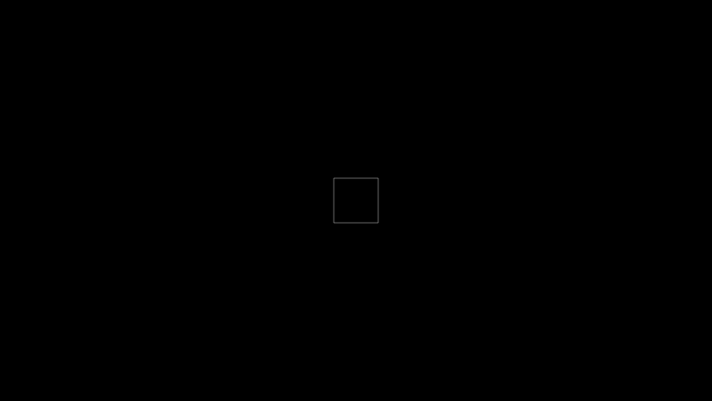
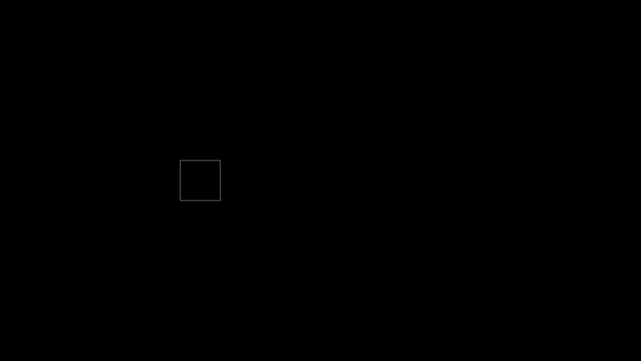
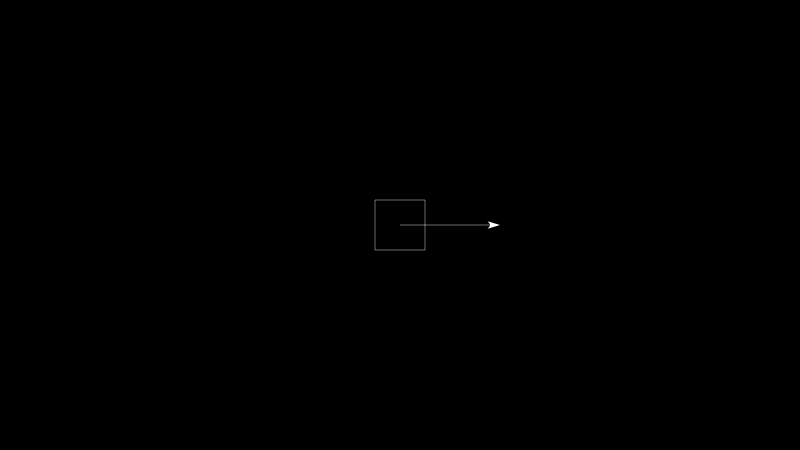

.. _quickstart:

Quickstart
==========

Minimal Animation Script
------------------------
A minimal animation script looks something like this:

.. literalinclude:: ./code/quickstart_ex1.py
  :start-after: # START
  :end-before: # END
  :linenos:

The output is a one second "animation" of the outline of a white 
rectangle sitting motionless in the center of the canvas.

Let's take a look at the code.

* In Line 1, we import ananimlib under the alias 'al' to save us
  some keystrokes and because "Namespaces are one honking great idea." 

* In line 3, we invoke the library's *Animate* method to start rendering frames.
  *Animate* takes a variable number of *Instructions* and executes them
  sequentially to create the final animation.    

* On line 8, we create an *AddAnObject* instruction to Add an Animation Object 
  to the scene.    

* *AddAnObject* takes an *AnObject* (Animation Object) as its input.
  In this case, we create a 1x1 *Rectangle*.  

* *AnObjects* added to the scene will appear in each frame of the animation
  unless they go off camera or are removed with *RemoveAnObject*.  

* Line 5 issues the *Wait* instruction which simply waits for the specified amount 
  of time without making any changes to the scene.  Without the wait instruction
  in this example, our animation would not contain any output frames since
  *AddAnObject* takes zero seconds of animation time.  

* Finally, Line 8 plays the resulting animation.

An Actual Animation
-------------------
Our first example wasn't much of an animation given that the rectangle didn't actually move.  
Let's make it move across the canvas.

.. literalinclude:: ./code/quickstart_ex2.py
  :start-after: # START
  :end-before: # END
  :linenos:

* At line 4, we've added the optional input *key* to *AddAnObject* which allows 
  us to refer to the rectangle by the string "rect" in later instructions.

* At Line 5, we inserted a *MoveTo* instruction.  This moves our rectangle 
  to absolute coordinates [-3,0].  *MoveTo* takes an optional *duration*
  argument that dictates how much animation time the move will take.  The
  default is 0.0 seconds so in this case, the move is instantaneous.  

* At Line 6, we inserted a *Move* instruction, which represents a move
  relative to the AnObject's current location.  This moves our rectangle 6 units
  horizontally and zero units vertically.  Here we've set the optional duration
  parameter to 1.0 so the move occurs over 1.0 second of animation time.  

Here's the output

.. image:: quickstart_ex2.gif
  :width: 95%
  :align: center

Simultaneous Instructions
-------------------------

What if we want the rectangle to spin 360 degrees at the same time that it's
moving across the canvas?  The *RunParallel* instruction allows you to execute a set of 
instructions simultaneoulsly.

.. literalinclude:: ./code/quickstart_ex3.py
  :start-after: # START
  :end-before: # END
  :linenos:

In this example, we instantiated our rectangle on Line 3 and passed a reference to 
AddAnObject on Line 6. We also passed a reference to the instructions at 
line 7, 9, and 10 rather than the String based key that we used in the previous example.  
You can refer to *AnObjects* in the scene either by reference or by key, if one was assigned.  

.. image:: quickstart_ex3.gif
    :width: 95%
    :align: center

| 

The *RunParallel* instruction can be combined with the *RunSequential*
instruction to achieve a variety of effects, like making two sequential moves
while simultaneously executing a full rotation.

.. literalinclude:: ./code/quickstart_ex4.py
  :start-after: # START
  :end-before: # END
  :linenos:

|

You can also use *RunSequential* and *RunParallel* to build complex instructions
from simpler instructions.  

.. literalinclude:: ./code/quickstart_ex8.py
  :start-after: # START
  :end-before: # END
  :linenos:

|

The About Point
---------------

Consider the following script.  Lines 8 and 9 rotate the rectangle 180 degrees
(pi radians) counter-clockwise and then back to zero.  Lines 14 and 15 do
exactly the same, but the rectangle sweeps out an arc rather than rotating about
its center.  This behavior is the result of the *SetAboutPoint* instruction at
line 12.  All position, rotation, and scale operations are performed with
respect to an *AnObject*'s about point.

.. literalinclude:: ./code/quickstart_ex5.py
  :start-after: # START
  :end-before: # END
  :linenos:

    
Below, we display the underlying coordinate grid as well as the rectangle's
about point to make it easier to see how the rotation relates to the about point.

.. image:: quickstart_ex6.gif
    :width: 85%
    :align: center

|

The about point is defined with respect to the AnObject's internal coordinate
system. In the next example, the move on line 9 is with respect to the center of
the rectangle.  On line 12, the rectangle's about point is moved to [-2,-1] with
respect to its own coordinate system so that the move to [0,0] on line 14 puts
the center of the rectangle at [2,1] with respect to the main coordinate grid.

.. literalinclude:: ./code/quickstart_ex5_1.py
  :start-after: # START
  :end-before: # END
  :linenos:

Here's the output again with the coordinate grid and the about point displayed.

  .. image:: quickstart_ex6_1.gif
    :width: 85%
    :align: center

The Composite AnObject
----------------------

*CompositAnObject* contains a collection of *AnObjects* which can then be
manipulated separately or as a group.  Here's an example:

.. literalinclude:: ./code/quickstart_ex7.py
  :start-after: # START
  :end-before: # END
  :linenos:

- In lines 3,4, and 5, we construct a *CompositeAnObject* to which we add a
  *Rectangle* and an *Arrow*. 
- The *MoveTo* at line 9 moves the entire composite to position [3,0] with
  respect to the main canvas.  
- The MoveTo in line 12 moves just the arrow to position [0.5,0] with respect to
  the *CompositeAnObject*. 
- On line 15, we move the about point of the arrow to
  [-0.5,0.0] with respect to itself. This puts the arrow's about point at 
  the [0,0] with respect to the *CompositeAnObject*, or [3,0] with respect to the main canvas.  
- On line 16, we rotate the Arrow 180 degrees (or \pi radians) around its about
  point.
- Finally, the MoveTo on line 19 moves the entire composite back to the origin of the 
  main canvas.  

