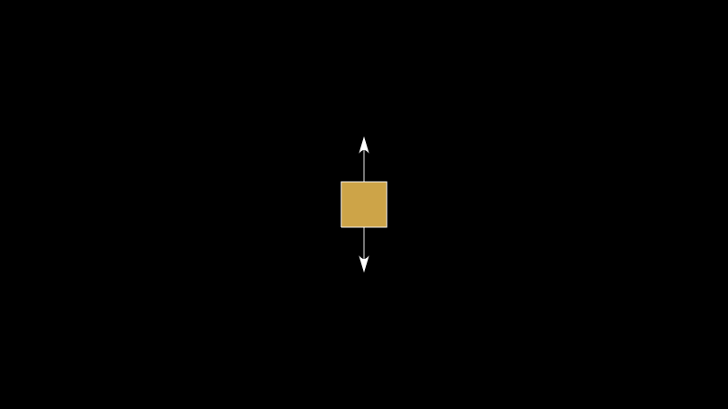

.. _tutorial:

============================
Tutorial: The AnAnimLib Logo
============================

One of the best ways to learn a new library is to do a project.  This tutorial
is a trip through the way that I think about creating animations. It is only one
possible work flow.  I am certain that this library could be twisted in a
variety of vile and perverse ways that I am completely unaware of.  If you know
of any, please share them!  At any rate, what follows is how I work.

Part 1: *SlideyBox*
^^^^^^^^^^^^^^^^^^^
As a thought exercise, look at the AnAnimLib logo as if you were simply
imagining it and wanted to build it.  It certainly started life that way.  

.. image:: Logo.gif
  :width: 50%

Looking at the animation now, the hypnotic motion of the little box as it
rotates and rides the curve has my attention. The rotation itself is mundane,
but the behavior of the two vectors (arrows) is interesting. The upwards
pointing vector rotates with the box but the lower vector always points down.
How can we make that happen?  

Being a physicist, I tend to hit the problem very hard until it breaks into the
smallest and simplest possible pieces. In this case, my smashing arrived at:
"Can I draw a box on the canvas and control its color?"  (It was originally just
"Can I draw a box on the canvas?" but we coverd that in the :ref:`Quickstart <quickstart>`!)

.. literalinclude:: ./code/tutorial.py
  :start-after: # START1
  :end-before: # END1
  :linenos:

|

Here, we create a *Rectangle* on Line 4 and pass it a *Pen* object, which allows
us to adjust its fill color, opacity, and outline (stroke) width.  Our call to
Animate has only two instructions, *AddAnObject* to put the rectangle in the
scene and *Wait* to display it for one second.  

Great.  Now, we make it rotate.  

.. literalinclude:: ./code/tutorial.py
  :start-after: # START2
  :end-before: # END2
  :linenos:

|

I wanted it to kind of wave at me, so there are three calls to *Rotate*, one for
each time it switches directions.  

Next, we add an upwards pointing arrow and a downwards pointing arrow.  The
upper arrow should rotate with the box, but the lower arrow should
remain staionary.  Here is our rough draft.  

.. literalinclude:: ./code/tutorial.py
  :start-after: # START3
  :end-before: # END3
  :linenos:

.. image:: tutorial_snip3.gif
  :width: 80%
  :align: center

| 

The arrows are in the scene, but the rotation on the top arrow isn't correct.
Looking closely at the animation, the arrow is rotating about its own tail while
the box is rotating about its center.  To make our rotations look correct, we
need to adjust the about point of the upper arrow so that it coincides with the
center of the box.  I'm also bugged by the tail of the lower arrow overlapping
the box, it just doesn't look clean.  We can change which object appears on top
by changing the order in which they are added to the scene.  

Those are minor issues.  What really bothers me about the code above is the
**repetition**.  The two blocks starting at lines 37 and 42 are nearly identical
and need to be broken out of the main body and turned into separate
instructions.  To fix it, we simply define a function called *wave* that returns
the results of the *RunSequential* call. 

.. literalinclude:: ./code/tutorial.py
  :start-after: # START4
  :end-before: # END4
  :linenos:

|

The output looks pretty solid.  The issue now (for me anyway) is that the main
body of the script is over 50 lines and I don't like thinking about that lines
many at one time.  Also, We ulitimately want to make that little box slide down
a hill, which is going to be tough with the code written the way it is.  It is
time for some restructing before things get out of hand.  

.. literalinclude:: ./code/tutorial.py
  :start-after: # START5
  :end-before: # END5
  :linenos:

.. image:: tutorial_snip5.gif
  :width: 80%
  :align: center

|

This program (it has functions and classes and stuff so it's not just a "script"
anymore)  has identical output, but we made a lot of structural changes. 

* On Lines 4-15 we have created a function called *tutorial_snip5* that contains
  the call to *Animate* so that no code exists outside of a function or class,
  other than the imports at the top and some code at the bottom that calls the
  function. 

* In *tutorial_snip*, we create only one *AnObject* called *SlideyBox* and the
  call to *Animate* has only three *Instructions*, two of which are the familiar
  *AddAnObject* and *Wait* instructions and a third called *wave_attr*.  

* The definition of *SlideyBox* begins on Line 18.  It is a *CompositeAnObject*, which is essentially a container that holds a set of anobjects.  We put all of the setup code
  from the previous example into *SlideyBox.__init__* 
  